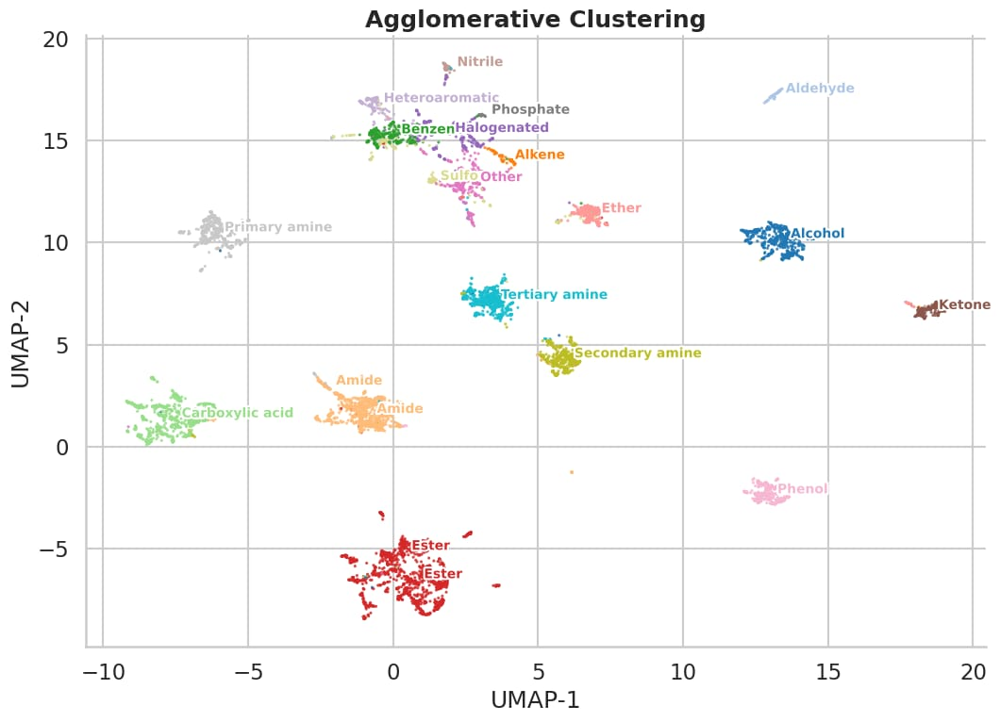

# Foundation-LCMS

> A modular research framework for self-supervised foundation models on untargeted LC-HRMS metabolomics.

  

---

## Overview

Foundation-LCMS aims to develop a general-purpose representation learning framework for untargeted LC-HRMS metabolomics.

Instead of optimizing models for a single downstream task, the objective is to learn transferable latent representations from large collections of public LC-HRMS datasets using self-supervised learning.

The long-term goal is to build a foundation model that can be adapted to a wide range of metabolomics applications, including compound detection, retrieval, anomaly detection, domain adaptation and molecular alignment.

---

## Research Goals

- Learn universal LC-HRMS representations
- Self-supervised pretraining on large public datasets
- Multimodal alignment with molecular embeddings
- Transfer learning across downstream metabolomics tasks
- Open-source reproducible research framework

---

## Planned Features

- Automatic mzML dataset discovery
- Modular preprocessing pipeline
- Multiple self-supervised learning objectives
- Foundation LC-HRMS encoder
- Molecular encoder integration
- Comprehensive benchmarking suite
- Representation analysis tools
- Reproducible experiments with Hydra

---

## Repository structure

For a detailed overview of the repository organization, see
[`docs/architecture.md`](docs/architecture.md).

---

## Roadmap

- Infrastructure
- Data ingestion
- Self-supervised pretraining
- Representation evaluation
- Molecular alignment
- Downstream transfer learning

---

## Installation

Coming soon.

---

## Project Status

🚧 Early research stage.

The repository is currently under active development.

---

## Citation

If this work contributes to your research, please cite the associated publication (coming soon).

---

## License

MIT License.
